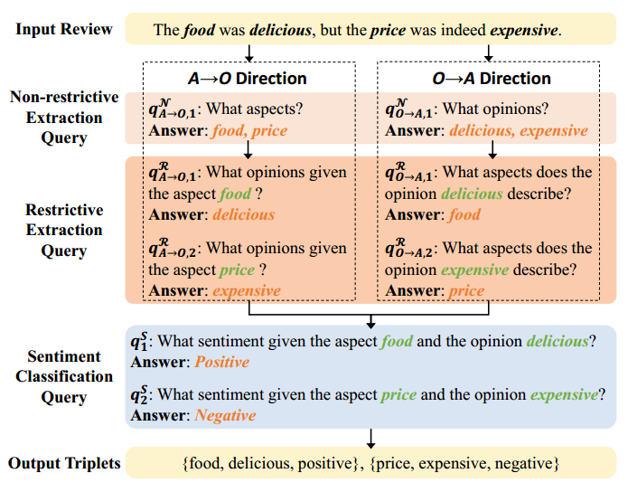

# B-MRC
MRC approach for Aspect-based Sentiment Analysis (ABSA)




### Usage

- Prepare data:
```commandline
python data_process.py --data_path data/14lap --a2o --o2a

Arguments:
    --data_path :       Path to the dataset
    --version   :       Optional version: unidirectional (A2O) and bidirectional (A2O + O2A) 
                        (default = 'bidirectiona')
                        Choices=['uni', 'bi', 'unidirectional', 'bidirectional']
```

```commandline
python make_data_dual --data_path data/14lap/preprocess --a2o --o2a

Arguments:
    --data_path :       Path to the dataset
    --version   :       Optional version: unidirectional (A2O) and bidirectional (A2O + O2A)
                        (default = 'bidirectiona')
                        Choices=['uni', 'bi', 'unidirectional', 'bidirectional']
```

```commandline
python make_data_standard --data_path data/14lab/pair --output_path ./data/14lap/preprocess

Arguments:
    --data_path  :      Path to the dataset
    --output_path:      Path to the output data      
```

- Training:
```commandline
python main.py \
    --version bidirectional \
    --data_path ./data/14lap/preprocess/ \
    --mode train \
    --model_type bert-base-uncased \
    --epoch_num 40 \
    --batch_size 4 \
    --learning_rate 1e-3
```
